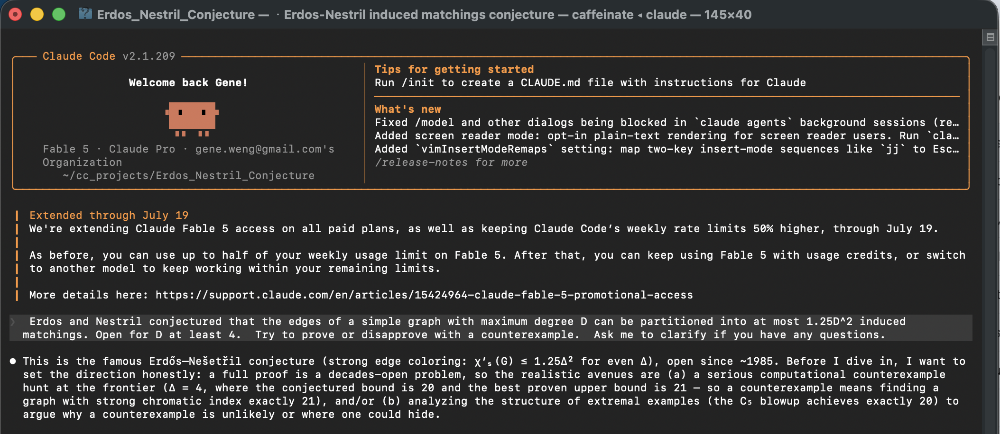

# Erdős–Nešetřil Conjecture: Computational Attack at Δ = 4

**Conjecture (Erdős–Nešetřil, 1985).** The edges of any simple graph with maximum
degree Δ can be partitioned into at most 1.25 Δ² induced matchings when Δ is even
(with a slightly sharper odd-Δ formula) — equivalently, for even Δ the
*strong chromatic index* satisfies χ′ₛ(G) ≤ 1.25 Δ².

Proved for Δ ≤ 3; **open for Δ ≥ 4**. At Δ = 4 the conjectured bound is **20**
and the best proven upper bound is **21** (Huang–Santana–Yu 2018), so a
counterexample is precisely a Δ = 4 graph with χ′ₛ = 21. The C₅ blowup
(each vertex of a 5-cycle replaced by an independent pair) is 4-regular with 20
pairwise-conflicting edges, so the bound is tight.

This repo is a systematic computational hunt for such a counterexample.
**No counterexample was found in the searches performed**, and one rigorous
negative result remains central: the strong clique number at `Delta = 4` is
exactly 20.

**Important correction.** An SME review on 2026-07-15 found that the proof notes
misused edge deletion: a strong coloring of `H - e` is not generally a coloring
of `L(H)^2 - e`, because deleting `e` can remove conflicts among other edges.
The claimed edge-critical reductions, including the reduction to the 4-regular
triangle-free case and proof-certified small-order exclusions based on that
pruning, are withdrawn. See [ERRATA.md](ERRATA.md).

Full write-ups:

* [ERRATA.md](ERRATA.md) — current correction and replacement proof framework.
* [REPORT.md](REPORT.md) — historical counterexample-hunt report; read together
  with the erratum.
* [PROOF_NOTES.md](PROOF_NOTES.md) — archival proof notes; the edge-critical
  deletion arguments are withdrawn.
* [PROOF_ATTEMPT.md](PROOF_ATTEMPT.md) — archival proof attempt; useful as a
  record of ideas and computations, not as a valid reduction proof.

Highlights:

* **The strong clique number of Δ ≤ 4 graphs is exactly 20** (SAT, with a
  rigorous 28-vertex reduction): the "clique version" of the conjecture holds
  tightly at Δ = 4, so any counterexample needs conflict-graph chromatic number
  strictly above clique number.
* Exact coloring computations on explicitly generated graphs remain valid; the
  reduced 4-regular triangle-free sweeps through order 17 are retained as
  exploratory evidence, not as proof-certified exclusions.
* Conditional on the now-withdrawn reduction, the order-17 high-greedy layer
  packs into at most 13 induced matchings after randomized maximum-matching
  tie-breaking. This is useful data for future conjecture formation, not a
  theorem about all counterexamples.
* Structured families (circulants, torus grids, line graphs of cubic graphs,
  cycle blowups — 747 graphs) stay below the bound except for the C₅ blowup
  itself; random-start annealing stays at χ′ₛ ≤ 17, while seeded C₅-blowup
  runs remain at the isolated peak 20 and every mutation collapses it.
* The proof direction is now to work with a vertex-21-critical induced subgraph
  `C0 subset L(G)^2`, whose vertices are a selected edge set in the ambient
  graph. Criticality applies to `C0`, not to edge deletions in `G`.

## Tooling

This project was carried out with **Claude Code** running the **Claude Fable 5**
model, which built the solvers and ran the searches. Several proof-reduction
claims have since been withdrawn; see [ERRATA.md](ERRATA.md).



## Key idea

A strong edge coloring of G is a proper vertex coloring of the conflict graph
L(G)² (vertices = edges of G; adjacent iff they share an endpoint or are joined
by an edge). All exact χ′ₛ computations reduce to graph coloring, decided with
the CaDiCaL SAT solver plus clique symmetry breaking.

## Setup

```sh
python3 -m venv .venv
.venv/bin/pip install networkx python-sat
brew install nauty          # for geng (exhaustive generation)
```

## Files

| File | Purpose |
|---|---|
| `sec.py` | Core toolkit: conflict graph, DSATUR/clique bounds, SAT coloring, exact χ′ₛ. Run directly for sanity checks. |
| `hunt_sweep.py` + `run_sweep.sh` | Exhaustive sweep: `./run_sweep.sh <n> <maxedges> <workers>` enumerates all connected graphs with degrees in [3,4] and ≥ 21 edges via `geng`, flags any χ′ₛ ≥ 21. |
| `hunt_strongclique.py` | SAT search for a 21-edge strong clique at Δ = 4 (`python hunt_strongclique.py <n> [target]`). |
| `hunt_strongclique_d.py` | Same, generalized: `python hunt_strongclique_d.py <D> <target> [N]`. |
| `hunt_structured.py` / `hunt_structured2.py` / `hunt_circulants.py` / `hunt_bounded.py` | Structured families: circulants, torus grids, line graphs of cubic graphs, odd-cycle blowups, and bounded-effort large family sweeps. |
| `hunt_anneal.py` | Simulated annealing over Δ ≤ 4 graphs: `python hunt_anneal.py <n> <seed> <steps>`. |
| `test_crosscheck.py` | Validation: SAT-based χ′ₛ vs. brute-force backtracking on 60 random graphs. |
| `results/` | Selected committed logs and search outputs. |
| `ERRATA.md` | Current correction: edge-critical deletion is invalid for strong coloring; replacement conflict-critical framework. |
| `REPORT.md` | Historical write-up: methods, searches, and interpretation; read with `ERRATA.md`. |
| `PROOF_NOTES.md` / `PROOF_ATTEMPT.md` | Archival proof notes; edge-critical deletion arguments are withdrawn. |
| `check_degree3_cross_edges.py` | Dependency-free finite check from the withdrawn degree-3 proof attempt; retained as conditional/exploratory tooling. |
| `check_regular_trianglefree_profiles.py` | Dependency-free `geng`-based profiler for the conditional 4-regular triangle-free local case, including KY density, Gallai tight-edge filters, and `--progress` for larger orders. |
| `check_reduced_small_orders.py` | Conditional reduced-family check after the withdrawn proof-attempt reductions; useful for exploration, not proof certification. |
| `analyze_reduced_extremes.py` | Extracts high-greedy conditional reduced survivors and optionally exact-colors their conflict graphs with a dependency-free bounded DSATUR backtracker; supports direct `--graph6` checks, `--summary-only`, `--structure`, `--witness`, `--witness-details`, `--pack`, and randomized packing knobs `--pack-trials`, `--pack-candidates`, `--pack-seed`. |

## Reproducing the Unaffected Headline Results

```sh
.venv/bin/python sec.py                        # sanity: C5=5, C5 blowup=20, Petersen=5
.venv/bin/python test_crosscheck.py            # solver cross-validation
.venv/bin/python hunt_strongclique.py 28       # UNSAT: no 21-edge strong clique, Δ≤4
.venv/bin/python hunt_strongclique_d.py 3 11   # UNSAT: matches known Δ=3 value
```

Historical/conditional reduced sweeps can still be reproduced from
`run_sweep.sh`, `check_reduced_small_orders.py`, and
`analyze_reduced_extremes.py`, but they should be read with [ERRATA.md](ERRATA.md).
